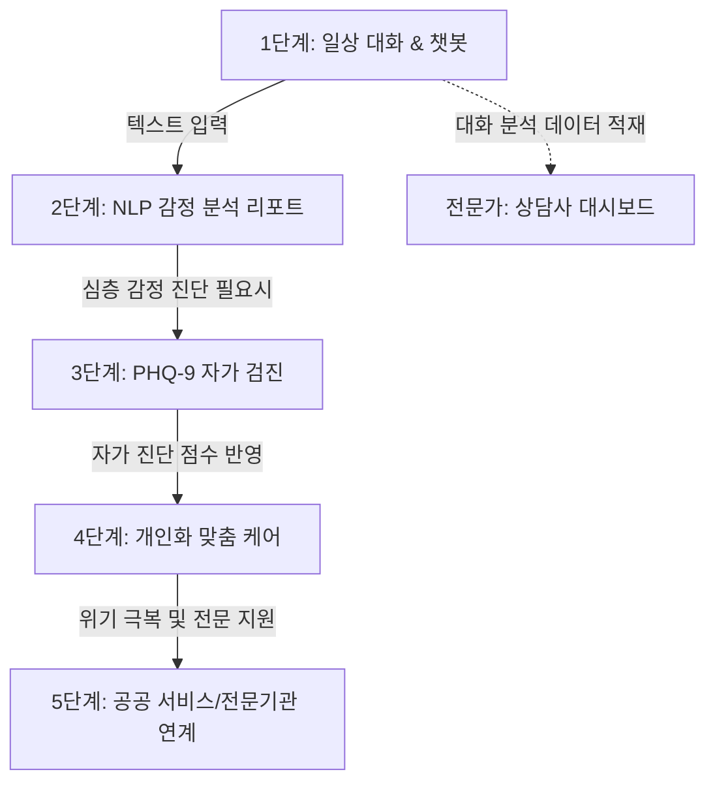
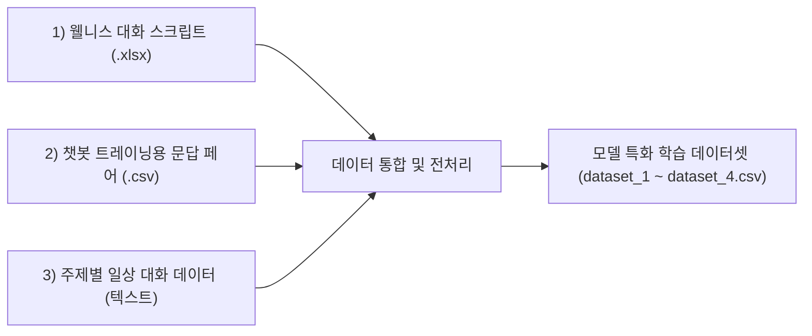

# 🫧 말랑해도 돼 (Bubble Care)
> **자연어처리(NLP) 기반 사용자 입력 문장을 활용한 우울 감정 지표 예측 모델 및 스마트 심리케어 솔루션 개발**


본 프로젝트는 사용자의 일상 발화 텍스트 데이터를 고도화된 NLP 모델을 통해 다차원으로 분석하여 **우울 감정 지표($P(우울)$)**를 정밀히 예측하고, 이를 **GPT-4o mini** 상담사 에이전트와 연계하여 최적의 스마트 심리케어 솔루션을 제공하는 정신건강 지원 플랫폼입니다.

---

## 기획 배경 및 사회적 문제의식 (Background & Problem Definition)

### 1. 왜 우울 위험 탐지가 중요한가 (국내 정신건강 현황)
* **OECD 자살률 1위의 장기화**: 대한민국은 **10만 명당 자살률 23.2명(2022년)**으로 OECD 국가 중 독보적인 1위를 차지하고 있습니다. 특히 **2024년 자살 사망자 수는 14,872명(10만 명당 29.1명)**으로 증가하여 2011년 이후 최고치를 기록하였습니다. 자살은 **10대부터 49세까지의 핵심 생산/청년층 사망 원인 1위**입니다.
* **우울증 유병률 급증**: 국내 우울증 유병률은 **2022년 6.1%에서 2024년 8.8%로 급격히 증가**하는 추세이며, 성별로는 여성이 남성보다 우울 위험에 더 취약합니다.
* **높은 전문 상담 장벽**: 전문가 정신건강 상담이 필요했음에도 치료를 받지 못한 가장 큰 원인으로 **‘상담비용 부담(38.6%)’**이 꼽힙니다. 이는 공공 및 디지털 환경에서의 1차 스크리닝과 보조 케어 솔루션이 절실함을 시사합니다.

### 2. 심리부검이 보여준 공백과 '놓친 신호들'
* **도움 연결의 사각지대**: 자살 사망자의 **87.0%가 생전에 우울, 불안 등 정신건강 문제**를 겪고 있었음에도, 지속적으로 치료나 전문 상담을 받은 비율은 **15.2%에 불과**했습니다. 
* **첫 시도로 곧바로 이어진 사망**: 전체 자살 사망자의 **60.2%는 평생 첫 번째 자살 시도에서 사망**에 이르렀습니다. 이는 사후 개입이 아닌, **초기 조기 발견**의 골든타임 확보가 무엇보다 중요함을 입증합니다.
* **AI 언어 모델이 해결 가능한 영역**: 보건복지부 심리부검 면담 결과 보고서에 따르면 자살사망자의 가장 흔한 경고 신호는 **우울한 기분(72.4%)**, **자살에 대한 직·간접적 언급(70.4%)**, **수면 상태 변화(69.7%)**였습니다. 이 신호들은 일상 구어와 텍스트 속에 뚜렷하게 존재하므로, **언어·표현 기반의 AI 기술(NLP)**이 가장 정밀하게 조기에 감지하고 안전하게 공공 기관으로 연계할 수 있는 도약점입니다.

---

## 🌟 주요 핵심 기능 (Key Features)

본 서비스는 학술적 근거에 기반하여 설계된 **5단계 서비스 파이프라인** 및 **전문가용 상담사 대시보드**를 제공합니다.



### 1️⃣ 1단계 : 일상 대화 및 공감형 챗봇 (💬 일상 대화)
* **다양한 페르소나 매칭**: 내담자의 선호와 심리적 거리감에 따라 최적의 소통을 돕는 5종의 대화 에이전트 페르소나를 지원합니다.
  * 🧑‍⚕️ **상담사 지우**: 따뜻하고 조심스러운 전문 심리 상담 톤앤매너 (존댓말 기반 공감 및 경청)
  * 🦔 **고슴도치 또치**: 반말 기반의 친근하고 든든한 동네 단짝 친구 톤 (감정의 벽을 허무는 밀착 상담)
  * 🤖 **어시스턴트 클로**: 중립적이고 차분하며 논리적인 분석 조력자 (상황 요약 및 조력 중심)
  * 👨‍🏫 **멘토 선생님**: 인생의 고민을 넓은 시야에서 바라보며 따뜻한 지혜를 담은 조언을 제공하는 멘토 톤
  * 😄 **개그맨 철수**: 가벼운 유머로 유쾌한 긍정 에너지를 채워주며, 위험 신호 포착 시 즉각 진지하게 공감하는 단짝 친구 톤
* **욕설 감지 & 초성 정제**: `ㅅㅂ`, `ㅂㅅ`, `ㅅ ㅂ` 등 초성 자음과 분리 띄어쓰기를 처리하는 다이나믹 욕설 필터 및 정제 기능 내장.

### 2️⃣ 2단계 : NLP 기반 심층 감정 분석 리포트 (📊 NLP 기반 감정 분석)
* **신뢰도 필터 (학술적 기준 반영)**: single-turn 대화의 한계를 극복하기 위해 **최소 3턴 이상의 발화** 및 전처리 후 **누적 10단어 이상(Chen, 2021 기준)** 획득 시 신뢰도 임계값을 충족하여 정식 분석 기능이 활성화됩니다.
* **형태소 분석(Kiwi) 기반 워드클라우드**: 부정어(안, 못, 없)와 감정 강조어(너무, 정말)의 의미 왜곡 방지를 위해 특수 정제 규칙을 적용하고, 단어의 원형(Lemma) 단위 빈도와 감정 기여도를 연계하여 시각화합니다.
* **감정 추이 대시보드**: 대화 진행에 따른 우울 감정 지표 변화를 Plotly 차트로 실시간 트래킹합니다.

### 3️⃣ 3단계 : PHQ-9 우울 자가진단 (📝 PHQ-9)
* 국가 및 의학 연구 표준 우울증 자가검진 문항(9문항)에 대한 사용자 친화적인 검진 패널을 구축하고, 총합 점수별 위험군 수준(양호/경도/보통/중증/위험)을 판별합니다.

### 4️⃣ 4단계 & 5단계 : 스마트 맞춤 솔루션 및 공공 연계 (🌱 맞춤 케어 / 🏥 공공 서비스)
* 자가 진단 및 대화 분석을 상호 결합한 3단계 맞춤 셀프케어 방안 가이드라인을 제공합니다.
* 고위험군 감지 시 복지로, 국립정신건강센터, 정신건강위기전화(1577-0199) 등과 즉각 연계할 수 있는 비상 프로토콜을 활성화합니다.

### 5️⃣ 전문가용 상담사 대시보드 (🩺 상담사 대시보드)
* 대화 단위의 실시간 감정 패턴과 개입 우선순위를 대시보드로 요약하여 전문가 또는 관리자의 개입 시점을 정량적으로 제시합니다.

---

## 💾 데이터셋 가공 및 통합 (Data Preprocessing & Fusion)

본 프로젝트는 고도의 감정 분석 모델 학습을 위하여 분산되어 있던 세 가지 한글 텍스트 원본 데이터셋을 통합하고 전처리 정제 작업을 거쳤습니다.



### 1. 원본 데이터셋 정보
1. **[웰니스 대화 스크립트 데이터셋](https://aihub.or.kr/aihubdata/data/view.do?currMenu=115&topMenu=100&dataSetSn=267) (`02)웰니스_대화_스크립트_데이터셋.xlsx`)**
   * 정신건강 및 심리 웰니스 도메인에 심층화된 내담자 대화 발화문과 전문가 챗봇 대화 쌍.
2. **[챗봇 트레이닝용 문답 페어](https://ko-nlp.github.io/Korpora/) (`챗봇 데이터세트.csv`)**
   * 일상적인 질의응답 및 전반적인 감정(기쁨, 슬픔, 평온 등)의 구어체 한글 발화문.
3. **[주제별 일상 대화 데이터](https://aihub.or.kr/aihubdata/data/view.do?dataSetSn=543) (`데이터 - 주제별 일상 대화/020.주제별 텍스트 일상 대화 데이터`)**
   * 연애, 학업, 직장 등 다양한 일상사 테마를 다룬 대화 텍스트 데이터.

### 2. 가공 결과물 및 데이터셋 설계 (`DA_data_preprocessing_process/`)
위 데이터들을 결합하여 결측치 제거, 불용어 필터링, 정규화, 구어체-표준어 맵 변환 및 감정 라벨 클래스(20개 도메인) 통합을 거쳐 **4개의 전처리 데이터셋**으로 구축하여 최적의 비율을 도출하였습니다.

| 데이터셋 구분 | 우울 관련 발화 수 | 일상 발화 수 | 구성 특징 (우울:일상 비율 설계) |
| :--- | :---: | :---: | :--- |
| **Dataset 1** | 19,666건 | 23,000건 | 웰니스 + 주제별 일상 + 챗봇 데이터 일부 혼합 |
| **Dataset 2 (최종 선정)** | 19,666건 | 18,000건 | 웰니스 + 주제별 일상 (**우울 대 일상 약 1:1 최적 균형 비율**) |
| **Dataset 3** | 19,666건 | 1,000건 | 웰니스 + 주제별 일상 (개별 감정 인텐트 비율 1:1 구성) |
| **Dataset 4** | 19,666건 | 6,261건 | 웰니스 + 주제별 일상 + 챗봇 데이터 전체 반영 |

* **최종 선정 근거**: 학습 성능 평가 및 검증 과정에서 **KLUE-BERT + Dataset 2** 조합이 가장 낮은 검증 손실(Validation Loss)과 극대화된 성능의 모델 일반화 지표를 기록하여 최종 서비스 모델로 선정되었습니다.

---

## 🧠 모델 아키텍처 및 심리 분석 메커니즘 (Model & Algorithm)

### 1. 핵심 전처리 엔진: 구어체 보정 & 부정어 매핑
* **SLANG_MAP (구어체 보정)**: 자살, 자해, 극심한 무기력 관련 은어 및 파편적인 구어체(예: `주글래`, `사라지고싶`, `살기싫`)를 NLP 처리 효율 향상을 위해 일차적으로 핵심 감정 명제로 교정 및 분류합니다.
* **부정어·강조어 유지**: Kiwi 형태소 분석 시 `"안", "못", "없어"` 등의 부정어와 `"너무", "정말"` 등 감정 강도를 결정하는 부사를 제거 리스트에서 제외하여 감정의 강도와 방향성을 100% 포착합니다.
* **접두사 자동 결합**: Kiwi 분석기의 형태소 특징을 활용하여 `무(XPN) + 기력(NNG)` 등 접두사와 감정 명사가 파편화되는 현상을 자동으로 차단 및 결합하여 하나의 명사 형태소로 추출합니다.

### 2. 학습 모델 및 미세조정 (Models & Fine-Tuning)
* 한국어 자연어 및 심리 구어체 처리에 뛰어난 **KLUE-BERT** 및 **KoELECTRA** 모델을 기반으로 20가지 감정 도메인 분류 미세조정(Fine-Tuning)을 수행하였습니다.
* **정신건강 도메인 특화 어휘 토큰 확장**: 
  기존 WordPiece 토크나이저가 `'우울감'`, `'자존감'` 같은 중요 감정 어휘를 `우울` + `##감` 형태로 분절하여 왜곡시키는 것을 방지하기 위해, **19가지 감정 카테고리 핵심 어휘를 사용자 정의 토큰(Custom Tokens)으로 사전에 등록**하여 문맥 이해의 정확도를 향상시켰습니다.
* **클래스 불균형 해소**:
  우울 관련 감정의 적은 데이터수와 일상 감정의 비대칭성을 극복하기 위해 `compute_class_weight('balanced')`를 사용하여 손실 함수에 가중치를 동적으로 설계하였습니다.
* **과적합 방지 최적 모델 저장**:
  전체 에포크(5 epochs) 동안 검증 데이터셋의 오차가 상승하기 직전, 최소 검증 손실(Validation Loss) 지점인 **Epoch 2**에서 모델 최종 저장 및 배포를 완료하였습니다.

### 3. 모델 성능 비교표 (Test Metric Evaluation)

| 백본 모델 (Model) | 학습 데이터셋 | 검증 정확도 (Val Acc) | 검증 F1 (Val F1) | 테스트 정확도 (Test Acc) | 테스트 F1 (Test F1) |
| :--- | :--- | :---: | :---: | :---: | :---: |
| **KLUE-BERT (★최종)** | **Dataset 2** | **0.9126** | **0.9121** | **0.9118** | **0.9110** |
| KLUE-BERT | Dataset 4 | 0.8950 | 0.8942 | 0.8932 | 0.8925 |
| KoELECTRA | Dataset 2 | 0.8874 | 0.8860 | 0.8841 | 0.8830 |
| KoELECTRA | Dataset 1 | 0.8650 | 0.8643 | 0.8621 | 0.8610 |

* **Optuna 하이퍼파라미터 튜닝**: 자동 하이퍼파라미터 튜닝 프레임워크인 Optuna를 통해 학습률(Learning Rate), 배치 사이즈, 가속 가중치를 탐색하여 **튜닝 전 베이스라인 대비 검증 오차(Val Loss)를 약 68.60% 감소**시켰습니다.

### 4. 감정 분석 모델의 예측 확률 및 다중 감정 클래스
* 미세조정된 모델(KLUE-BERT / KoELECTRA)은 입력 문장으로부터 정신건강 도메인에 특화된 **20가지 감정 클래스에 대한 Softmax 확률값**을 예측하고 정량적으로 산출합니다.
* **우울 위험 지표의 계량적 도출 (참고)**:
  * 본 연구에서는 학술 논문(오재동·오하영, 2022)의 설계 사상을 참고하여, 모델이 예측하는 20가지 Softmax 확률값 중 `일상` 발화(Index 11)일 확률을 $1.0$에서 차감하여 **우울 위험 확률 스코어**로 활용합니다.
  
  $$P(\text{우울}) = 1.0 - P(\text{일상})$$
  
  * 모델 자체는 개별 감정의 독립적이고 정량적인 Softmax 확률값만을 예측 및 출력하며, 이 지표와 예측 강도를 바탕으로 챗봇 시스템(GPT-4o mini)과의 실시간 정밀 협업 및 다각적인 리포트 시각화를 실현합니다.

### 5. 설명 가능성 확보 (XAI: LIME 및 SHAP 적용)
* 사용자의 감정이 분류되는 근거에 대한 불투명성(Black-box)을 제거하기 위해 **LIME**과 **SHAP**을 백엔드에 탑재하였습니다. 이를 통해 "사는 게 너무 힘들어. 이제 그만하고 싶어"와 같은 텍스트에서 `'사는 게'`, `'힘들어'`, `'그만하고'` 등의 주요 키워드가 우울 위험도 판단에 기여한 가중치를 시각적으로 하이라이트할 수 있도록 설계했습니다.

### 6. GPT-4o mini 융합 프롬프팅
미세조정된 KLUE-BERT 모델이 예측한 실시간 감정 확률 상위 3가지 및 우울 위험도 지표를 GPT-4o mini 상담사의 `system` 지침서에 실시간 주입합니다.
* **인공지능 상담 윤리 보장**: 약물 처방이나 단순 의학적 진단을 원천 차단하고, 🟠 **중증** 이상의 위험 지수가 포착될 시 심리적 안전을 확보하는 공감과 함께 기관 위기 상담 전화 정보 제공 및 전문 의뢰 프로토콜로 자연스럽게 유도하도록 방어 프롬프트를 보강했습니다.

---

## 📂 디렉토리 구조 (Directory Structure)

```text
├── .gitattributes              # Git LFS 트래킹 설정 파일
├── .gitignore                  # Git 추적 예외 규칙 설정 파일
├── model.py                    # KLUE-BERT 모델 로딩 및 전처리, 예측 및 LLM 프롬프트 조립 엔진
├── mallang_최종파일.py         # Streamlit 5단계 심리 케어 웹 메인 솔루션
├── team3.ipynb                 # 데이터 분석 및 모델 학습/평가 프로토타이핑 주피터 노트북
│
├── DA_data_preprocessing_process/
│   ├── dataset_1.csv          # 가공 및 통합된 심리 특화 학습 1번 데이터셋
│   ├── dataset_2.csv          # 가공 및 통합된 심리 특화 학습 2번 데이터셋
│   ├── dataset_3.csv          # 가공 및 통합된 심리 특화 학습 3번 데이터셋
│   └── dataset_4.csv          # 가공 및 통합된 심리 특화 학습 4번 데이터셋
│
├── saved_models/
│   └── KLUBERT_Dataset2/      # streamlit 배포용 메인 파인튜닝 KLUE-BERT 대용량 모델 폴더 (LFS 관리)
│       ├── model.safetensors  # 모델 가중치 파일 (442MB, Git LFS 업로드 완료)
│       ├── config.json        # 모델 설정 파일
│       └── vocab.txt          # 토크나이저 어휘 사전 파일
│
└── 데이터셋/                  # 가공 전 원본 아카이브 파일
    ├── 02)웰니스_대화_스크립트_데이터셋.xlsx
    ├── 챗봇 데이터세트.csv
    └── 데이터 - 주제별 일상 대화/
```

---

## 🚀 빠른 시작 (Quick Start)

### 1. 의존성 패키지 설치
프로젝트 구동에 필요한 라이브러리를 설치합니다.
```bash
pip install streamlit torch transformers pandas numpy plotly matplotlib wordcloud kiwipiepy openai python-pptx pypdf
```
* 형태소 분석의 완전한 활용을 위해 `kiwipiepy` 사용을 권장합니다.

### 2. OpenAI API 키 설정
챗봇 에이전트의 구동을 위해 OpenAI API Key가 환경 변수로 로드되어야 합니다.
* **Windows (PowerShell)**:
  ```powershell
  $env:OPENAI_API_KEY = "your-openai-api-key-here"
  ```
* **Windows (CMD)**:
  ```cmd
  set OPENAI_API_KEY=your-openai-api-key-here
  ```
* **macOS / Linux**:
  ```bash
  export OPENAI_API_KEY="your-openai-api-key-here"
  ```

### 3. Streamlit 실행
서버를 기동합니다.
```bash
streamlit run mallang_최종파일.py
```

---

## 📚 참고 학술 문헌 (Academic References)
* **오재동, 오하영 (2022)**. *NLP 기반 우울 감정 탐지 및 분석 모델 연구*. 한국정보통신학회논문지.
* **Bae, M. N. et al. (2022)**. *Psychiatric and psychosocial factors of suicide decedents: Psychological autopsy study of Incheon City*. IJERPH.
* **Chen, L. (2021)**. *Text preprocessing and feature engineering for short informal text classification*.
* **Nandwani, P. & Verma, R. (2021)**. *Systematic review on sentiment analysis in healthcare*.
